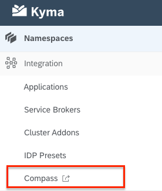
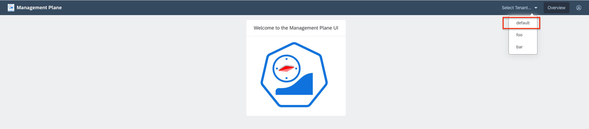
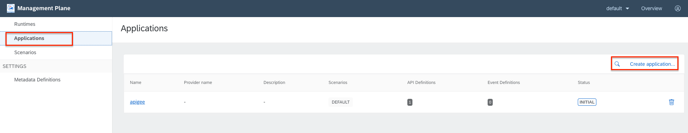
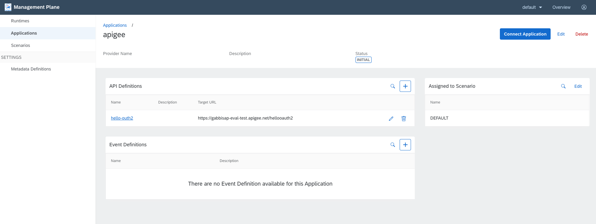
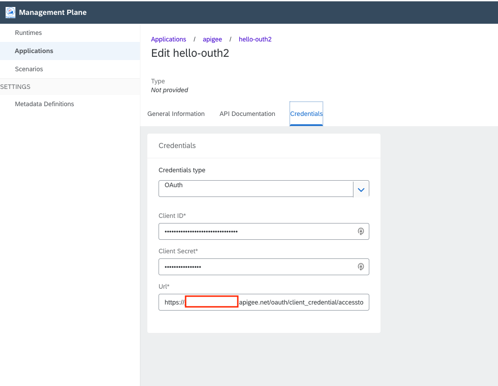
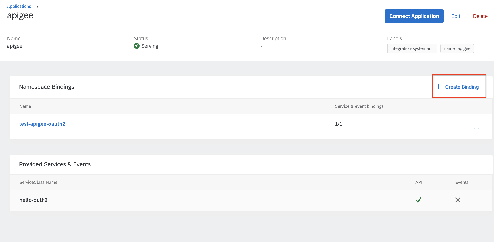
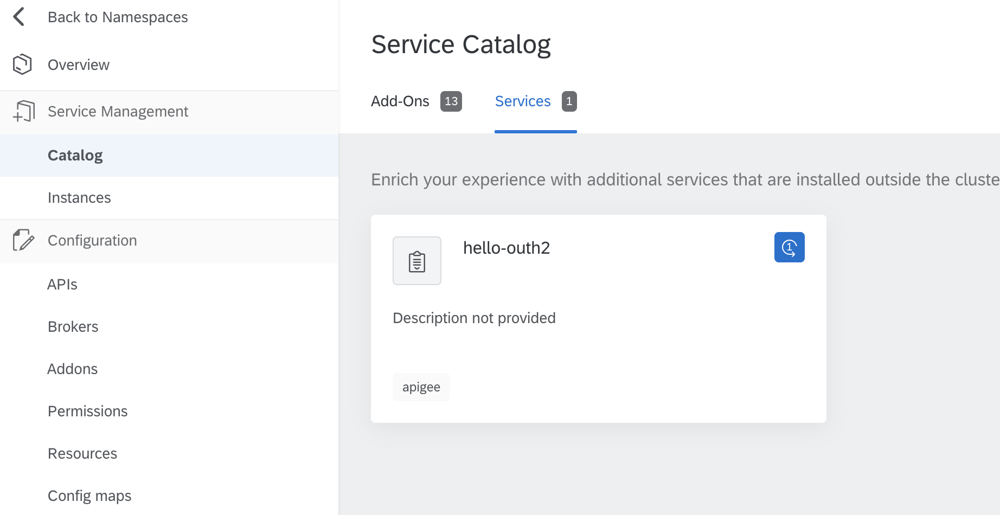
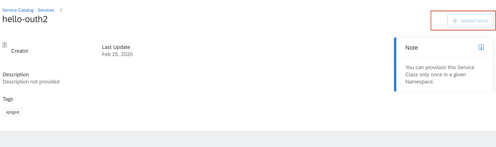
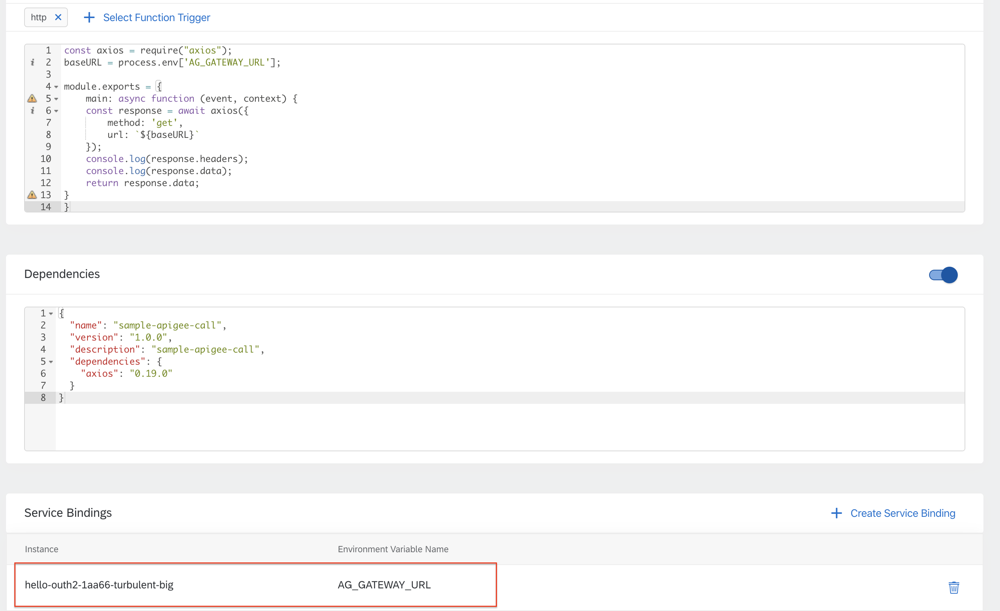

# Overview

Kyma apigee integration

## Steps

### apigee configuration

* Set up a test apigee account or use one you already have.
* [Set up an endpoint using OAuth](https://docs.apigee.com/api-platform/tutorials/secure-calls-your-api-through-oauth-20-client-credentials)
* Set the policy for access token with `grant_type` as form parameter.

    ```xml
    <?xml version="1.0" encoding="UTF-8" standalone="yes"?>
    <OAuthV2 name="GenerateAccessTokenClient">
        <!-- This policy generates an OAuth 2.0 access token using the client_credentials grant type -->
        <Operation>GenerateAccessToken</Operation>
        <!-- This is in millseconds, so expire in an hour -->
        <ExpiresIn>3600000</ExpiresIn>
        <SupportedGrantTypes>
            <!-- This part is very important: most real OAuth 2.0 apps will want to use other
            grant types. In this case it is important to NOT include the "client_credentials"
            type because it allows a client to get access to a token with no user authentication -->
            <GrantType>client_credentials</GrantType>
        </SupportedGrantTypes>
        <GrantType>request.formparam.grant_type</GrantType> <!--changed this part -->
        <GenerateResponse/>
    </OAuthV2>
    ```

* Added `AssignMessage` to send numeric values as Json Numbers/Integers. This is required as by default apigee token reponse sends all numeric values as Json Strings. This causes the Kyma Oauth client to fail to parse. See this [apigee community thread](https://community.apigee.com/questions/41535/oauthv2-policy-response-numeric-values-surrounded.html).

    ```xml
        <?xml version="1.0" encoding="UTF-8" standalone="yes"?>
    <AssignMessage async="false" continueOnError="false" enabled="true" name="expires_in_to_int">
        <DisplayName>expires_in_to_int</DisplayName>
        <Properties/>
        <Set>
            <Payload contentType="application/json">
            {
                "refresh_token_expires_in" : {oauthv2accesstoken.GenerateAccessTokenClient.expires_in},
                "api_product_list" : "{oauthv2accesstoken.GenerateAccessTokenClient.api_product_list}",
                "organization_name" : "{oauthv2accesstoken.GenerateAccessTokenClient.organization_name}",
            "issued_at": {oauthv2accesstoken.GenerateAccessTokenClient.issued_at},
            "client_id" : "{oauthv2accesstoken.GenerateAccessTokenClient.client_id}",
            "access_token" : "{oauthv2accesstoken.GenerateAccessTokenClient.access_token}",
            "application_name" : "{oauthv2accesstoken.GenerateAccessTokenClient.application_name}",
            "scope" : "{oauthv2accesstoken.GenerateAccessTokenClient.scope}",
                "expires_in" : {oauthv2accesstoken.GenerateAccessTokenClient.expires_in},
            "refresh_count" : {oauthv2accesstoken.GenerateAccessTokenClient.refresh_count},
            "status" : "{oauthv2accesstoken.GenerateAccessTokenClient.status}"
            }
            </Payload>
        </Set>
        <IgnoreUnresolvedVariables>true</IgnoreUnresolvedVariables>
        <AssignTo createNew="true" transport="http" type="response"/>
    </AssignMessage>
    ```

## Kyma configuration

* [Enable compass in existing Kyma](https://kyma-project.io/docs/components/compass#installation-enable-compass-in-kyma) or if creating a new Kyma cluster, uncomment compass components in [installer.yaml](https://github.com/kyma-project/kyma/releases/download/1.10.0/kyma-installer-cluster.yaml)
* Create an application via Compass
  
  
  
* Set up an API with Oauth access
  * client_id,
  * client_secret,
  * token url of the form `https://{your environment}.apigee.net/oauth/client_credential/accesstoken`
  
  

## Calling apigee API

Follow the standard steps to consume an API from a namepace.

* Bind the application with the namespace.

* API will be available in servcie catalog

* Add it once

* Create a lambda to make API call
